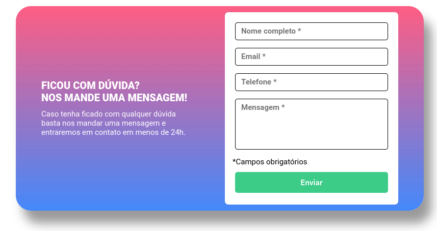

# Exercício 09 | Quest do DevQuest HTML + CSS avançado

## Aplicando JavaScript Intermediário

Colocando em prática todos os estudos até agora de HTML e CSS avançado além de JS Intermediário

## alguns pontos:
olá, primeriamente muito obrigado por esta equipe corrigir meu trabalho, gostaria de saber todos e quaisquer pontos a melhorar.
Não sabia se era para focar em responsividade ou se o projeto era para ocupar a tela toda, mas foquei no JS.

<a href="https://lucasramosfs.github.io/projeto11-desafio-devquest-js-intermediario/ "> Clique aqui para acessar a página</a>

### Resultado final

